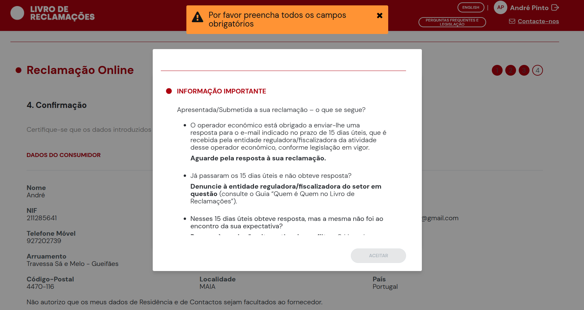
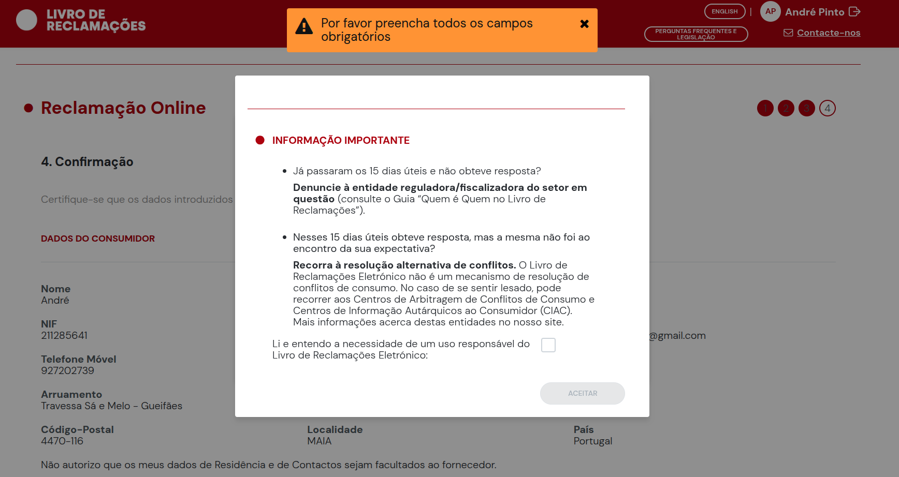
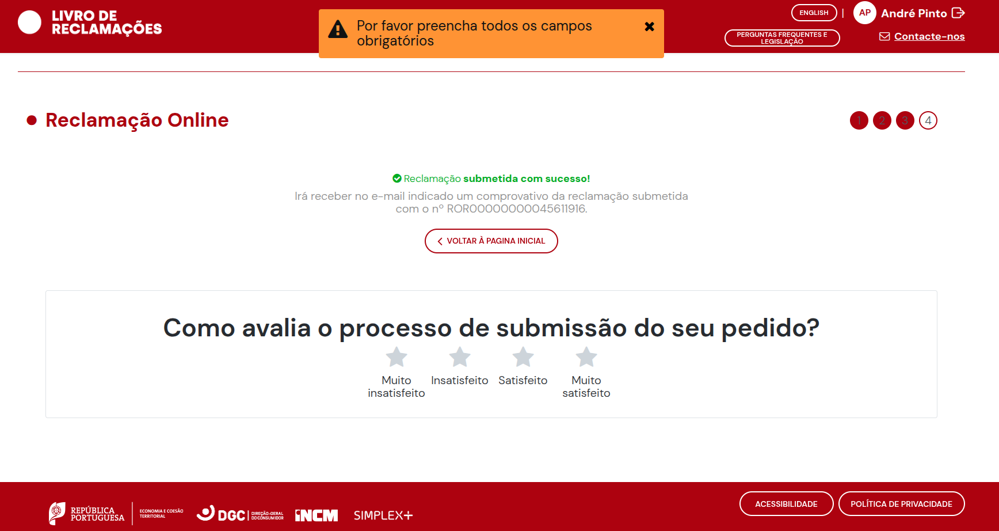

#site

    https://www.livroreclamacoes.pt/Pedido/Reclamacao

No dia 27/05/2026, durante uma viagem em comboio da CP — Comboios de Portugal, sofri um acidente no interior do comboio enquanto este se encontrava em movimento.

Ao deslocar-me no interior da composição, sofri um impacto contra um objeto exterior ou junto à zona de entrada do comboio. Acrescento que a zona/abertura junto à entrada do comboio onde ocorreu o impacto aparentava encontrar-se aberta, possivelmente devido ao calor, circunstância que solicito que seja averiguada pela CP através dos registos internos, tripulação, composição do comboio e eventuais imagens disponíveis.

O impacto causou lesões na mão esquerda/dedo, com sangramento e suspeita/confirmação de fratura, bem como lesão no joelho esquerdo, com dor e limitação funcional.

Após o incidente, fiquei caído no chão do comboio, tendo sido assistido por passageiros e posteriormente por meios de emergência/ambulância, com encaminhamento para avaliação médica.

Solicito a abertura de processo interno de averiguação, a preservação de eventuais imagens de videovigilância, relatórios internos, comunicações operacionais e demais registos relacionados com o incidente.

Solicito ainda a identificação da entidade ou seguradora responsável por sinistros de responsabilidade civil da CP, bem como indicação do procedimento para apresentação de pedido de indemnização pelos danos físicos, despesas médicas, transportes, tratamentos e demais prejuízos resultantes do acidente.

Sem prejuízo do processo de acidente de trabalho atualmente tratado pela minha entidade empregadora/seguradora, pretendo que a CP avalie a sua responsabilidade pelos factos ocorridos e pelos danos sofridos.

Reservo-me o direito de juntar posteriormente relatórios médicos, exames, fotografias das lesões, despesas e demais documentação comprovativa.

---

---

identificacao da queixa

    ROR00000000045611916

---

| Item                    | Dado                                         |
| ----------------------- | -------------------------------------------- |
| Reclamação CP           | **ROR00000000045611916**                     |
| Apólice Caravela        | **100138637**                                |
| Entidade/contacto saúde | **TrueClinic / gestor de saúde — 226164122** |
| Próximo interlocutor    | **RH / Sofia Pires**                         |

